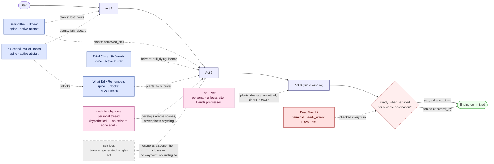

# How threads work

A companion to `Story_Mechanics_Update.md` (CR-10, CR-05) and `Authoring_Tool_Spec.md` — this
is the mental model, not the spec. For the authoritative field-by-field schema, read those.
For where each field is edited on the storyboard, see the board itself (`/author/<slug>/board`)
or `Authoring_Tool_Spec.md` §4.3.

## Two structures, not one

It's tempting to picture a story as one sequence — chapter 1, chapter 2, chapter 3 — the way a
novel reads. Palimpsest actually has **two separate structures**, layered on top of each other,
and confusing them is the easiest way to misdesign a story on the board.

**Acts (`plot.main_thread.acts`) are the sequential one.** They're your chapters: Act 1, Act 2,
Act 3, each with its own title, description and theme, moving forward in order toward the
finale. `check_and_advance_act` decides when the story moves from one to the next, bounded by
`max_acts` (default 6, not counting the finale).

**Threads (`plot.subplots`) are not chapters, and are not sequential.** They run **in
parallel**, alongside each other and alongside whichever act is current. Several threads can
be active at the same time, each periodically getting a scene, each independently working
toward its own goal. A novelist juggling a heist crew's recruitment, a security-casing job, and
an informant relationship *simultaneously* — weaving all three through the same chapters rather
than giving each its own chapter — is the closer analogy than "chapter by chapter."

The AI doesn't schedule threads on a timetable. Act generation and the pacing nudge *judge*,
turn by turn, which currently-active thread deserves the next scene — that's the "AI judges
when to use it" part of the diagram below.

## The three thread roles

| Role | Purpose | Must carry a waypoint? | Who authors it? |
|---|---|---|---|
| `spine` | Carries waypoints toward an ending | Yes — that's the point of the role | Authored; generated only as a fallback (and then only when generated *for* a specific uncarried waypoint) |
| `personal` | A relationship arc | Optional — *may* carry waypoints, doesn't have to | Authored only, never generated |
| `texture` | Episodic breathing room: jobs, deadlines, local trouble | Never — carries nothing, by definition | Authored, or generated freely — the one role the engine can invent unprompted |

The distinguishing question for `spine` vs `personal` isn't "is this plot-critical" — it's
"whose job is it to feed an ending." A relationship arc that never touches an ending's waypoints
is `personal`, not a weaker `spine`. A thread with no relationship content that exists purely to
deliver a waypoint is `spine`, even if it's thin.

`texture` is structurally different from the other two, not just thematically: it's **single-act**
(must resolve within the act it started in, never spans several), **at most one is active at a
time**, and it **never has a `delivers` edge** — L09/the health panel don't ask a texture thread
for waypoints because it structurally can't carry any. It exists to give the story something to
do in a quiet turn without touching the ending machinery at all.

## How a thread actually reaches an ending

A thread doesn't reach an ending by finishing. It reaches an ending by **carrying a waypoint**:

1. A destination ending (`mechanics.endings.entries[]`, `kind: "destination"`) authors one or
   more `waypoints` — each one something the story needs to set up, written as an *event*
   ("a buyer at Tally who pays too well"), never as its *meaning* ("evidence of the bloodline").
2. A thread `delivers` a specific waypoint — `["the_end.some_waypoint"]` — which is the colored
   line on the board connecting a thread's port to an ending.
3. The waypoint is recognised as done via `done_when` (a condition the engine checks, e.g. a
   stat threshold) or `detect` (free text a judge reads the scene against). Every waypoint needs
   at least one of the two, or it can never be marked complete — that's L09.
4. The ending's `ready_when` condition decides when it can actually commit — commonly
   `{"waypoints_done": "all"}` combined with other conditions (a stat threshold, a relationship
   score). **This is the real mechanism for "gate an ending behind multiple subplots"**: several
   independent threads each deliver a different waypoint to the same ending, and `ready_when`
   requires all of them.

Threads don't need to unlock each other to jointly feed one ending. They can all be
`starts_active: true` from turn one, entirely independent, each just responsible for its own
piece.

**`unlocks` (`activate_when`) is a separate, optional relationship** — it controls *when a
thread becomes available*, not what an ending requires. Use it when a thread genuinely
shouldn't be reachable yet (needs a stat threshold, needs another thread to have progressed
first). It is not how you connect threads toward a shared ending — that's `delivers`.

**Failure prunes destinations.** A thread can author `fail_when` (a condition). If it trips, the
thread is marked failed, and any destination whose *uncompleted* waypoints are carried only by
failed threads gets pruned from the funnel — this is the mechanism by which walking away from a
person or burning a bridge can permanently close off an ending.

## Worked example

The diagrams below use The Missing Core's real threads (per `Story_Mechanics_Update.md`'s
CR-10 mapping table for that story), simplified to keep the picture readable — real Missing
Core has four destinations scored in parallel, collapsed here to one generic commit check.

Reading it:

- The **bottom row** (`Start → Act 1 → Act 2 → Act 3 → Commit`) is the only linear thing in the
  picture — the chapters.
- **Every thread box floats independently above the act line.** None of the four spine threads
  are in sequence with each other; three of them are active from turn one and run concurrently.
- **Dotted arrows into an act** mean "the AI judged this act was the right moment for this
  thread's waypoint to land" — a live decision, not a fixed schedule.
- **The one solid line between two threads** (`Hands → unlocks → Tally`) is the exception
  pattern, not the default. Most threads have no relationship to any other thread at all.
- **`Belt jobs` (texture) is a dead end on purpose** — no line reaches `COMMIT` from it, ever,
  because texture structurally cannot carry a waypoint.
- **`RELARC` (personal, no delivers edge)** sits next to `The Diver` (personal, does deliver) to
  show that carrying a waypoint is optional for `personal`, unlike `spine` where it's the reason
  the role exists.
- **The terminal** sits off the act line entirely — checked every turn, in any act, independent
  of the whole thread/waypoint system above.

## Authoring this on the storyboard

- **`role`** is a selector on a thread's Detail panel: spine / personal / texture.
- **`delivers`** is drawn, not typed: drag from a thread's port onto an ending, and pick which
  waypoint it carries (or use the Matrix tab for a thread-by-waypoint grid once a story has a
  lot of threads).
- **`starts_active`** vs **`activate_when`**: the "Becomes active" section on a thread's Detail
  panel — either "active at start," or an incoming `unlocks` edge with a condition.
- **`fail_when`**, waypoint **`done_when`**/**`detect`**, an ending's **`ready_when`**/
  **`viable_while`**, and an unlock's condition all use the same **condition builder**:
  dropdowns for stat / relationship / flag / revelation / thread status / turn / act /
  waypoints-done / tier-reached, combinable with all-of / any-of / not (nested at most three
  deep, CR-02's cap), plus a **Raw JSON** toggle for anything it can't express. The options
  come from the story itself - stat axes, revelations, the Cast tab, the thread cards - so a
  typo can't name something that doesn't exist. It writes CR-02's canonical spelling, e.g.
  `{"stat": "reach", "gte": 50}`.

## What's actually live today

This matters and is easy to get wrong: **the board can author all of the above right now, and
it round-trips correctly, but not all of it does anything in actual play yet.**

- `starts_active` **works** — it's a pre-overhaul field the engine has always read.
- `activate_when` **does nothing in play today.** The engine only ever checks `starts_active`
  when a save is created; nothing currently evaluates `activate_when` to flip a thread active
  later. A thread wired up with only an `unlocks` edge will sit `not_started` forever in a real
  playthrough until the engine work for it lands.
- `delivers`, waypoints, and the whole ending funnel (`mechanics.endings`) **do nothing in play
  today either** — `ending_funnel` isn't a registered engine yet. A story authoring
  `mechanics.endings` fails to load loudly (`UnknownEngineError`) rather than silently doing
  nothing, which is deliberate (see CLAUDE.md, "Build order: the storyboard leads, the engine
  follows") — the board is the upstream design surface, and the engine's job is to catch up to
  what's already authored, not the reverse. Engine work for this lands piece by piece, as real
  authoring on the board needs it — not pre-planned ahead of time.

So: design freely. What you build on the board is real, saved, correct content — it's just not
*playable* content yet for the parts the engine hasn't caught up to.
